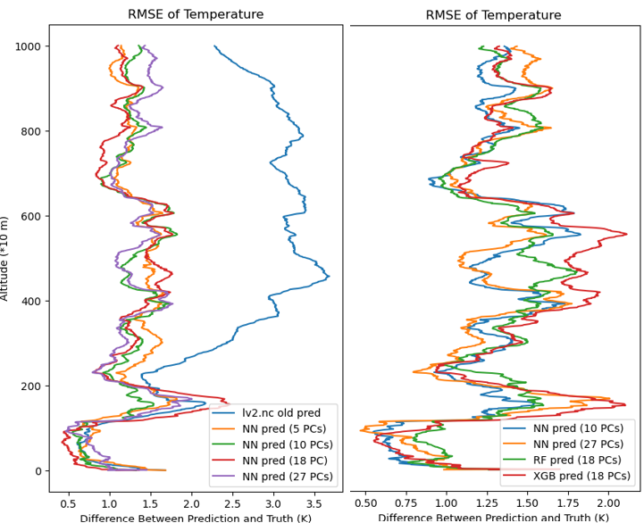
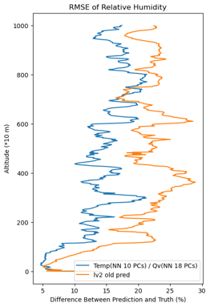

# Temperature and Vapor Density Profile Retrieval with Spectrometer Data Using Multi-Input-Multi-Output Regression

## Author
Je-Ching (Michael) Liao | Academia Sinica | University of Michigan

## Date
June 2024

## Overview
This project consists of two parts: first part being the developing and experimentation and the second part is the Python package creation. This project uses weather data collected by spectrometer at the ground level, such as the energy level of different radio channels, the ground temperature and humidity, etc, to retrieve the entire temperature and vapor density profiles of the air column above. This project uses the true temperature and vapor density profile data recorded by the radiosonde attached under weather balloons as training data. Recognizing that this is a multi-input-multi-output (MIMO) regression tasks, this project also created a Python package to provides tools to apply MIMO regression tasks using Random Forest, XGBoost, or Neural Networks. The package is designed to handle various preprocessing steps, model training, and evaluation, making it easier to implement complex regression models.

There is a separate README.md for the Python package.

## Introduction
To retrieve the atmospheric sounding profiles (temperature and humidity) of the Taiwan region from radiance readings of spectrometer. The current retrieval quality has a lower resolution and misses important features. Physical retrieval is time consuming and relatively difficult to formulate.

## Methodology

## Data Processing
We use collocated sounding profiles and spectrometer data from September 2023 to December 2023 and March 2024 to train different machine learning algorithms. There are 134 samples, each has spectrometer readings, previously retrieved results, and a sounding profile from either RCTP, RS41 or ST sensor. To ensure a meaningful retrieval, only data recorded during a sunny day, i.e., the “Rain” field marked as 0, are kept to be trained on. Among them, some sounding profiles are not complete, with data at higher altitude missing, and are not suitable for training machine learning models. After setting these 66 incomplete samples aside for evaluation, we are left with 53 valid samples for training.
The predictors are the radiance data recorded in brightness temperature (Tb) from 35 channels of the spectrometer as well as surface temperature, pressure, relative humidity from the ground level (0 m) from sounding profiles. We exclude binary predictors as well as less relevant factors such as infrared temperature. Notability, out of the 35 channels of radiance data, the 24GHz channel is excluded due to high interference from telecommunication signals. As a result, we have 37 predictors.
The predictands are the 1001 levels of sounding profiles that represent 1001 10-meter intervals covering 10000m from the ground. We are only interested in predicting the temperature and vapor density profiles, with which the relative humidity profiles can be derived.

## Data Manipulation
In the beginning, we start out with 53 samples; yet the training results are not satisfactory. Data augmentation is needed to increase data volume. Considering the summation of many random processes, in this case, many random factors affecting the measurement of the spectrometer, tends to have a Gaussian distribution due to Central Limit Theorem, we triple the data volume by adding N(0,1) noise to one copy of the predictor data, and subtracting N(0,0.8) noise from another copy. Finally, we concatenate these three slightly different data to form a larger dataset of 159 samples.

Since machine learning algorithms are better off with the number of predictands equal to or less than the number of predictors, we also create dimensionally reduced predictands through principal component analysis (PCA). By finding the principal components of a matrix, a handful of dimensions alone can represent the features of a matrix with hundreds or thousands of dimensions. This way, machine learning models can be trained in a significantly shorter time and reach similarly satisfying results. We have tried to reduce the 1001 dimensions down to 5, 10, 18, and 27 principal components, which lead to different results combined with different algorithms.
 
## Machine Learning Algorithms

### Random Forest Regressor with Multi-output

A random forest consists of several decision trees, each built on randomly chosen subsets of data (AnalytixLabs, 2023). Each decision tree consists of decision nodes that maximize information gain in terms of difference in entropy and divide the dataset accordingly (Koli, 2023). The random forest then aggregates the outputs of all the decision trees to make predictions (AnalytixLabs, 2023). Normally, a random forest leverages several decision trees to predict one value; yet in our use case, a multivariate output is required, as the predictands could have 1001 dimensions for one sample. To address this need, we wrapped RandomForestRegressor() with MultiOutputRegressor(), both from the Python package scikit-learn.
Random forest regression is less prone to overfitting and handles non-linearities better, which works well in capturing the relationship between radiance data and sounding profiles (AnalytixLabs, 2023).

### eXtreme Gradient Boosting Regressor

eXtreme Gradient Boosting (XGBoost) Algorithm is an improved version of the gradient boosting algorithm. A gradient boosting algorithm creates several weak learning models, i.e., decision trees, sequentially and assesses their performance, as well as monitoring samples with large errors. Misclassified samples are given larger weights to focus on them, while weak models that perform well are also given larger weights to amplify their impact in the final ensemble model. All weak models are “boosted”, i.e., updated, through “gradient” descent (Malik, Harode, & Kunwar, 2020). XGBoost algorithm is a finetuned version of gradient boosting algorithm with better efficiency, extensive regularization and higher flexibility (Karale, 2024). The robustness is beneficial to our use case. Yet, similar to the random forest regressor, we set the multi_strategy hyperparameter of XGBRegressor() to ‘multi_output_tree’ in order to accommodate our scenario.
 
### Neural Network

A Neural Network is made up of an input layer, an output layer, and several hidden layers in between. The layers consist of neurons, where a linear operation is undertaken, and the result is fed into a non-linear activation function to produce the result to feed into the neurons of the next layer if the current is not an output layer. Thanks to the highly customizable number of layers and neurons within the layers as well as the various activation functions, Neural Network is very good at capturing non-linear relationships, handling high dimensional data, and uncovering hidden patterns (Beekhani, 2024). 
Here, the input layer has 37 neurons for the 37 dimensions of predictors, and the output layer has as many neurons as the number of dimensions that represent the predictands, i.e., number of principal components or the original 1001 dimensions. There are two hidden layers in between, consisting of 30 and 20 neurons respectively. The number of neurons in each hidden layer gradually decreases from the number of input dimensions. For the loss function, mean square error loss (nn.MSELoss()) is used, function shown as Eq.1. For each sample, the difference between the prediction y ̂_i and the ground truth y_i is squared and summed, then taken average over all the sample points.
                        L=1/N ∑_(i=1)^N▒〖(y_i- y ̂_i)〗^2                            (1)
The optimizer used here is the AdamW algorithm (optim.AdamW()). A machine learning optimizer minimizes the loss function by adjusting the weights of the formula (Eq.2) in each neuron iteratively. More specifically, it adjusts the w and b.
                           y=wx+b                                (2)
 The optimization method is generally through gradient descent; the AdamW is no exception. The AdamW algorithm is a variant of the Adam algorithm, which stands for Adaptive Momentum Estimate. The Adam algorithm combines the best of the both worlds of momentum-based propagation and root-mean-square propagation and is able to handle sparse gradients on noisy problems (Franco, 2023). The “W” in AdamW stands for weight decay, which makes the weights smaller and helps the model to generalize better. Originally, the position of weight decay in the Adam algorithm undermines its ability to generalize; the AdamW algorithm fixes the problem and yields smaller training losses (Graetz, 2018).
 
## Experiments and Results
All three machine learning algorithms are experimented with the predictands in various dimensions. The 159 training set goes through a 0.8/0.2 split to create the training/test data set. We use mean square error (MSE) across the entire training/test set against the ground truth to serve as a criterion for comparison. We can refer to Table 1 and Table 2 for performance of different configurations on temperature and vapor density retrieval respectively.
|  |
|:--:| 
| Table 1. Mean Square Error Various Models for Temperature Retrieval |
|  |
| Table 2. Mean Square Error Various Models for Vapor Density Retrieval |

From the two tables, we can see that although keeping the predictand dimensions as original yields low MSE, the training time is hundreds of seconds, as opposed to under 10 seconds when PCA is incorporated. We could see that Random Forest method with 5 PCs has the shortest training time, as it is explainable from the small amount of output and the simpler architecture of the Random Forest algorithm. XGBoost algorithm with the original predictand dimension yields the best training error, while algorithms with a moderate number of PCs have better test errors.
We then pick out an individual sample and plot the predictions alongside the ground truth and the previous prediction provided. From Fig. 1, we can see that, for temperature predictions, all Neural Network predictions retain the inverse temperature structure just like the ground truth, while the previous prediction does not. Neural Network predictions with 5 and 27 PCs deviate from the ground truth more than those with 10 and 18 PCs. Overall, we can tell that different methods yield similar results for temperature prediction due to the less fluctuating structure of temperature (Fig. 2). 
|  |
|:--:| 
| Fig. 1 Temperature Prediction of an Individual Sample (All Neural Network) |
|  |
| Fig. 2 Temperature Prediction of an Individual Sample (Random Forest, XGBoost, Neural Network) |

For vapor density predictions (Fig. 3), both the ground truth trend and the predictions fluctuate more. We can see the Neural Network prediction with 18 PCs has widely varied results, while the one with 5 PCs does not show as many features. From Fig. 4, we can tell that Random Forest has unnecessarily high resolution, while XGBoost shows discrepancy.

|  |
|:--:| 
| Fig. 3 Vapor Density Prediction of an Individual Sample (All Neural Network) |
|  |
| Fig. 4 Vapor Density Prediction of an Individual Sample (Random Forest, XGBoost, Neural Network) |

Examining individual samples can only take us as far as checking whether the models can grasp the features of the structures. We need to evaluate the models with an overall criterion: root mean squared error (RMSE). Across the 1001 altitude levels, temperature prediction difference with the ground truth as well as vapor density difference ratios with the ground truth are squared, summed, taken square roots, and then averaged over the entire test dataset. From Fig. 5, we can see all methods perform better than the previous prediction from 2000m and above for temperature prediction. We can see that Neural Network with 5 and 18 PCs has larger errors for some altitudes. When compared to Random Forest and XGBoost, Neural Network with 10 PCs is the better model, yielding smaller errors overall.
For vapor density prediction (Fig. 6), the previous prediction performs worse under 2000m but rather perfectly above 4000m. Neural Network with 5 and 27 PCs often have too big a difference, while the Random Forest and XGBoost algorithms have discrepancies too large at certain altitudes. Eventually, Neural Network with 18 PCs is picked as the better model. Notably, under 1000m excluding ground level (Fig. 7), almost all methods yield difference ratios smaller than 0.15, while the previous prediction has a 0.8 difference ratio.

|  |
|:--:| 
| Fig. 5 RMSE for Temperature Prediction |
|  |
| Fig. 6 RMSE for Vapor Density Prediction |
|  |
| Fig. 7 RMSE for Vapor Density Prediction Below 1500m |

Having picked our preferred methods for temperature and vapor density retrieval, we proceed with constructing the retrieval for relative humidity. First, we calculate saturated and actual vapor pressure from temperature and vapor density. Actual vapor pressure is calculated through Eq. 3, where the vapor pressure (e) is in Pa, ρ_v is vapor density in kg/m3, T is temperature in K, and R_v is the ideal gas constant for water vapor.
                           e=ρ_v R_v T                                (3)
The saturated water vapor e_s is calculated through Eq. 4, where T is temperature in degrees Celsius.
                       e_s=6.11 × 10^( (7.5 × T)/(237.3 + T))                          (4)
Together, the relative humidity rh is calculated from saturated and actual water pressure through Eq. 5.
                           rh=e/e_s   × 100                            (5)
After retrieving the relative humidity, some individual samples are picked out to plot a comparison between the retrieval result and the ground truth. From Fig. 8, we can see that the trends are alike, yet the smaller patterns are different to a certain extent. The overall comparison is clearer when we examine the RMSE plot (Fig. 9 & Fig. 10). The retrieval error is on average 10% smaller than the previous prediction.

|  |
|:--:| 
| Fig. 8 Relative Humidity Prediction of an Individual Sample |
|  |
| Fig. 9 RMSE for Relative Humidity |
|  |
| Fig. 10 RMSE for Relative Humidity Below 2000m |

## References

AnalytixLabs. (2023, 12 26). Random Forest Regression — How it Helps in Predictive Analytics? Retrieved from Medium: https://medium.com/@byanalytixlabs/random-forest-regression-how-it-helps-in-predictive-analytics-01c31897c1d4

Beekhani, S. (2024, 5 22). Advantages and Disadvantages of Neural Network. Retrieved from Linkedin: https://www.linkedin.com/pulse/advantages-disadvantages-neural-network-suresh-beekhani-8bhhf/

Franco, F. (2023, 10 29). ADAM optimization in machine learning. Retrieved from Medium: https://medium.com/@francescofranco_39234/adam-optimization-in-machine-learning-cfeb10a27a86

Graetz, F. M. (2018, 6 3). Why AdamW matters. Retrieved from Medium: https://towardsdatascience.com/why-adamw-matters-736223f31b5d

Karale, J. (2024, 4 22). Understanding The Difference Between GBM vs XGBoost. Retrieved from TALENT500: https://talent500.co/blog/understanding-the-difference-between-gbm-vs-xgboost/

Koli, S. (2023, 2 27). Decision Trees: A Complete Introduction With Examples. Retrieved from Medium: https://medium.com/@MrBam44/decision-trees-91f61a42c724

Malik, S., Harode, R., & Kunwar, A. S. (2020, 2 4). XGBoost: A Deep Dive into Boosting. Retrieved from Medium: https://medium.com/sfu-cspmp/xgboost-a-deep-dive-into-boosting-f06c9c41349

## License
This project is licensed under the MIT License.

## Contact
For any questions or issues, please contact Je-Ching (Michael) Liao at jechingliao@gmail.com / michaeljcliao@gmail.com .
